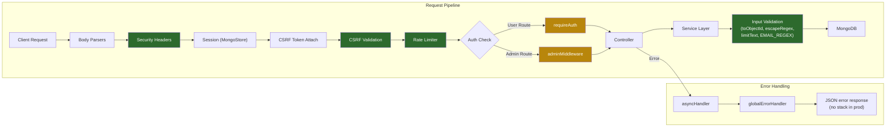

# CloudPDF — Security Overview

## Executive Summary

CloudPDF implements a solid baseline of security controls for an Express-based web application: bcrypt password hashing, session-based auth with MongoStore, custom CSRF protection with timing-safe comparison, per-route rate limiting, security headers (CSP, X-Frame-Options, nosniff), and input sanitisation. However, there are several areas that need attention ranging from **critical** credential-handling concerns to moderate authorization gaps.

---

## ✅ What's Currently Implemented

### 1. Authentication & Password Security

| Control | Implementation | Location |
|---|---|---|
| Password hashing | bcrypt, 10 salt rounds | [userService.js:243](file:///c:/Users/Cadig/Downloads/CloudPDF/services/userService.js#L243) |
| Login credential check | `bcrypt.compare()`, generic error message on failure | [authController.js:166-169](file:///c:/Users/Cadig/Downloads/CloudPDF/controllers/authController.js#L166-L169) |
| Session regeneration | `req.session.regenerate()` on login, OTP verify, and password reset | [authController.js:104](file:///c:/Users/Cadig/Downloads/CloudPDF/controllers/authController.js#L104), [171](file:///c:/Users/Cadig/Downloads/CloudPDF/controllers/authController.js#L171), [247](file:///c:/Users/Cadig/Downloads/CloudPDF/controllers/authController.js#L247) |
| Session destruction | `req.session.destroy()` + `clearCookie()` on logout and self-destruct | [authController.js:220-224](file:///c:/Users/Cadig/Downloads/CloudPDF/controllers/authController.js#L220-L224) |
| Password minimum length | 8 characters enforced | [userService.js:158](file:///c:/Users/Cadig/Downloads/CloudPDF/services/userService.js#L158) |
| Session secret enforcement | Throws on missing `SESSION_SECRET` in production | [server.js:21-23](file:///c:/Users/Cadig/Downloads/CloudPDF/server.js#L21-L23) |

### 2. OTP / Email Verification

| Control | Detail |
|---|---|
| OTP generation | `crypto.randomInt(100000, 1000000)` — cryptographically random 6-digit code |
| OTP expiry | 10 minutes (configurable via `OTP_EXPIRATION_MS`) |
| Max verification attempts | 5 attempts before lockout (configurable via `OTP_MAX_VERIFY_ATTEMPTS`) |
| Resend cooldown | 60-second cooldown between resends |
| Anti-enumeration | Password reset returns generic `{ success: true }` even for non-existent emails |
| Session-scoped pending registration | OTP + pending user data stored in session, not DB, preventing partial user creation |

### 3. CSRF Protection

| Control | Detail | Location |
|---|---|---|
| Token generation | `crypto.randomBytes(24).toString("hex")` — 48 hex chars | [csrfMiddleware.js:9](file:///c:/Users/Cadig/Downloads/CloudPDF/middleware/csrfMiddleware.js#L9) |
| Token delivery | Via `GET /auth/csrf-token` endpoint | [server.js:76](file:///c:/Users/Cadig/Downloads/CloudPDF/server.js#L76) |
| Token validation | Checks `x-csrf-token` header on all non-GET/HEAD/OPTIONS requests | [csrfMiddleware.js:23-43](file:///c:/Users/Cadig/Downloads/CloudPDF/middleware/csrfMiddleware.js#L23-L43) |
| Timing-safe comparison | Uses `crypto.timingSafeEqual()` + length check | [csrfMiddleware.js:33-38](file:///c:/Users/Cadig/Downloads/CloudPDF/middleware/csrfMiddleware.js#L33-L38) |

### 4. Rate Limiting

| Route Group | Window | Max Requests | Key Strategy |
|---|---|---|---|
| Auth (`/auth/*`) | 15 min | 20 | `IP:path` |
| Upload (`/upload`) | 15 min | 12 | `session.user.id \|\| IP` + path |
| Messages (`/messages`) | 10 min | 8 | `session.user.id \|\| IP` + path |

Implementation: Custom in-memory sliding window with periodic cleanup and configurable `maxKeys` cap (default 10,000).

### 5. Security Headers

All responses include ([server.js:41-50](file:///c:/Users/Cadig/Downloads/CloudPDF/server.js#L41-L50)):

```
X-Content-Type-Options: nosniff
X-Frame-Options: DENY
Referrer-Policy: same-origin
Content-Security-Policy: default-src 'self'; script-src 'self'; style-src 'self' 'unsafe-inline';
                         img-src 'self' data:; connect-src 'self'; object-src 'none';
                         base-uri 'self'; frame-ancestors 'none'; form-action 'self'
```

### 6. Input Validation & Sanitisation

| Technique | Usage | Location |
|---|---|---|
| Email normalisation | `trim().toLowerCase()` on all email inputs | Throughout auth flows |
| Email format validation | `EMAIL_REGEX` pattern check | [constants.js:7](file:///c:/Users/Cadig/Downloads/CloudPDF/config/constants.js#L7) |
| Regex escaping | `escapeRegex()` for all user-provided search terms used in `$regex` queries | [securityUtils.js:3-5](file:///c:/Users/Cadig/Downloads/CloudPDF/services/securityUtils.js#L3-L5) |
| Text length limiting | `limitText()` truncates user input (subjects: 160 chars, messages: 4000 chars, search: 80 chars) | [securityUtils.js:7-9](file:///c:/Users/Cadig/Downloads/CloudPDF/services/securityUtils.js#L7-L9) |
| ObjectId validation | `toObjectId()` validates all user-supplied IDs before Mongo queries | [securityUtils.js:11-17](file:///c:/Users/Cadig/Downloads/CloudPDF/services/securityUtils.js#L11-L17) |
| Pagination bounds | `Math.min/Math.max` clamping on page, limit params | Throughout admin/upload controllers |
| File MIME check | Multer `fileFilter` rejects non-`application/pdf` | [uploadRoutes.js:12-14](file:///c:/Users/Cadig/Downloads/CloudPDF/routes/uploadRoutes.js#L12-L14) |
| File magic bytes check | `%PDF-` header validation on raw buffer | [uploadController.js:16-18](file:///c:/Users/Cadig/Downloads/CloudPDF/controllers/uploadController.js#L16-L18) |
| File size limit | 5 MB maximum upload | [uploadRoutes.js:10](file:///c:/Users/Cadig/Downloads/CloudPDF/routes/uploadRoutes.js#L10) |

### 7. Session Configuration

| Setting | Value |
|---|---|
| Cookie name | `cloudpdf_session` |
| `httpOnly` | `true` (prevents JS access) |
| `sameSite` | `lax` (CSRF mitigation) |
| `secure` | `true` in production only |
| `maxAge` | 1 hour |
| Store | MongoStore (persistent across restarts) |
| `resave` | `false` |
| `saveUninitialized` | `false` |

### 8. Authorization

| Level | Implementation | Location |
|---|---|---|
| Auth guard | `requireAuth` middleware — checks `req.session.user` | [requireAuth.js](file:///c:/Users/Cadig/Downloads/CloudPDF/middleware/requireAuth.js) |
| Admin guard | `adminMiddleware` — checks `req.session.user.isAdmin` | [adminMiddleware.js](file:///c:/Users/Cadig/Downloads/CloudPDF/middleware/adminMiddleware.js) |
| Self-action prevention | Admins can't demote themselves or archive their own account | [userService.js:61-63](file:///c:/Users/Cadig/Downloads/CloudPDF/services/userService.js#L61-L63), [80-85](file:///c:/Users/Cadig/Downloads/CloudPDF/services/userService.js#L80-L85) |
| Last-admin protection | Cannot remove admin role if only 1 admin remains | [userService.js:69-73](file:///c:/Users/Cadig/Downloads/CloudPDF/services/userService.js#L69-L73) |
| Owner-scoped data | Upload queries filter by `user: userId` | Throughout upload controller/service |

### 9. Secrets Management

| Item | Status |
|---|---|
| `.env` | ✅ Gitignored (`.env`, `.env.*`) |
| Firebase service account JSON | ✅ Gitignored via `config/*.json` and never committed to git history |
| `externalDB/` | ✅ Gitignored |
| `uploads/` | ✅ Gitignored |
| Session secret | ✅ Required in production, fallback in dev only |

### 10. Logging & Audit Trail

- Admin actions are logged to MongoDB `Logs` collection with actor, action, target, and timestamp
- Whitelisted actions only — prevents log noise
- Winston structured logging to stdout for external log aggregation
- `globalErrorHandler` logs 5xx errors with full stack traces, 4xx as warnings

### 11. Soft Delete Architecture

Records are never hard-deleted on first action — they go through an **archive → permanent delete** lifecycle. This provides an audit trail and recovery capability.

---

## ⚠️ Identified Vulnerabilities & Risks

### 🔴 Critical

#### C1: Pending Registration Stores Plaintext Password in Session

**Location:** [authController.js:38-55](file:///c:/Users/Cadig/Downloads/CloudPDF/controllers/authController.js#L38-L55)

The `register` handler stores the user's **plaintext password** in `req.session.pendingRegistration.password` while awaiting OTP verification. This password persists in the MongoDB sessions collection until the session expires or OTP is verified.

```javascript
// The plain password is stored here and saved to MongoStore
req.session.pendingRegistration = {
  ...pendingUser,  // includes password: req.body.password (plaintext)
  otpCode,
  otpExpiresAt: Date.now() + OTP_EXPIRATION_MS,
  ...
};
```

**Risk:** If the sessions collection is compromised (DB leak, backup exposure), plaintext passwords for all pending registrations are exposed.

**Remediation:** Hash the password immediately with bcrypt _before_ storing in the session. Then use the pre-hashed value when creating the user in `verifyOtp`.

---

#### C2: OTP Code Stored in Plaintext in Session & Database

**Location:** [authController.js:49](file:///c:/Users/Cadig/Downloads/CloudPDF/controllers/authController.js#L49) (session), [userService.js:185](file:///c:/Users/Cadig/Downloads/CloudPDF/services/userService.js#L185) (database)

OTP codes are stored as plaintext strings in both session data (registration flow) and in the User model (password reset flow). A database breach would expose all active OTPs.

**Remediation:** Hash OTPs with bcrypt or SHA-256 before storage. Compare using the same hash on verification.

---

### 🟠 High

#### H1: Missing Auth Middleware on Many Upload & Message Routes

**Location:** [uploadRoutes.js](file:///c:/Users/Cadig/Downloads/CloudPDF/routes/uploadRoutes.js), [messageRoutes.js](file:///c:/Users/Cadig/Downloads/CloudPDF/routes/messageRoutes.js)

Only `POST /upload` uses the `requireAuth` middleware at the route level. All other upload routes rely on **inline `req.session?.user` checks** inside the controller. While this works, it's fragile — a missed check on a new endpoint would be an auth bypass.

Routes currently lacking route-level auth middleware:
- `POST /upload/precheck`
- `GET /upload/status/:id`
- `POST /analysis/compare`
- `POST /analysis/gaps`
- `POST /analysis/defense`
- `GET /uploads`
- `GET /uploads/archived`
- `POST /upload/:id/restore`
- `DELETE /upload/:id/permanent`
- `DELETE /upload/:filename`
- `POST /messages/`
- `GET /messages/inbox`
- `GET /messages/inbox/summary`
- `POST /messages/inbox/:id/read`

**Remediation:** Apply `requireAuth` as middleware on all authenticated routes at the router level, not as inline checks.

---

#### H2: No Resource Ownership Check in Admin Upload Archive

**Location:** [adminController.js:138-152](file:///c:/Users/Cadig/Downloads/CloudPDF/controllers/adminController.js#L138-L152)

`adminController.deleteUpload` calls `uploadService.archiveUpload(uploadId)` without passing a `userId`, which means the `archiveUpload` function skips the ownership check. This is correct for admin behavior, but the `uploadService.archiveUpload` function treats a missing userId as "no ownership constraint", which could mask bugs.

The same pattern applies to `adminController.restoreUpload` and `adminController.permanentlyDeleteArchivedUpload`.

**Remediation:** Consider making the distinction between admin and user paths more explicit (e.g., separate service methods or an explicit `isAdmin` flag) rather than relying on the absence of a userId.

---

#### H3: Hardcoded Development Session Secret

**Location:** [server.js:59](file:///c:/Users/Cadig/Downloads/CloudPDF/server.js#L59)

```javascript
secret: process.env.SESSION_SECRET || "development-only-session-secret"
```

While there's a production check at line 21-23, the fallback secret is a well-known string. If `NODE_ENV` is not explicitly set to `"production"`, the app would run with an insecure secret even in a deployed environment.

**Remediation:** Either remove the fallback entirely and always require `SESSION_SECRET`, or ensure the production check covers all non-local deployments.

---

### 🟡 Medium

#### M1: Rate Limiter State Is In-Memory Only

**Location:** [rateLimit.js](file:///c:/Users/Cadig/Downloads/CloudPDF/middleware/rateLimit.js)

Rate limit state is stored in a local `Map`. On a multi-instance deployment (e.g., Render with multiple dynos), each instance has its own state, effectively multiplying the allowed request count by the number of instances.

**Remediation:** For single-instance deployment (current Render setup) this is acceptable. For multi-instance, use Redis-backed rate limiting.

---

#### M2: No Helmet.js or Equivalent

Security headers are set manually. While the current set is good, `helmet` would add additional protections:
- `Strict-Transport-Security` (HSTS) — not currently set
- `X-Permitted-Cross-Domain-Policies`
- `X-DNS-Prefetch-Control`
- `X-Download-Options`

**Remediation:** Add `Strict-Transport-Security` at minimum for the production deployment. Consider adopting `helmet` for comprehensive coverage.

---

#### M3: CSP Allows `'unsafe-inline'` for Styles

**Location:** [server.js:47](file:///c:/Users/Cadig/Downloads/CloudPDF/server.js#L47)

```
style-src 'self' 'unsafe-inline'
```

This allows inline `<style>` tags and `style` attributes, which can be exploited for CSS injection attacks.

**Remediation:** If inline styles are required, use CSP nonces. Otherwise, move all styles to external CSS files and remove `'unsafe-inline'`.

---

#### M4: Uploaded PDFs Served from Static Directory Potentially

The `uploads/` directory is at the project root. While `express.static` is configured for `public/`, if path traversal were possible through `filename` parameters, uploaded files could potentially be accessed. The current code does validate filenames through multer's `dest` configuration, but there's no explicit path traversal check on the `filename` parameter in `DELETE /upload/:filename`.

**Location:** [uploadController.js:295](file:///c:/Users/Cadig/Downloads/CloudPDF/controllers/uploadController.js#L295)

**Remediation:** Add explicit path traversal protection: `if (filename.includes('..') || filename.includes('/') || filename.includes('\\'))`.

---

#### M5: Error Handler Leaks Stack Traces in Non-Production

**Location:** [errorMiddleware.js:33-39](file:///c:/Users/Cadig/Downloads/CloudPDF/middleware/errorMiddleware.js#L33-L39)

When `NODE_ENV` is not `"production"`, the full error stack trace is included in API JSON responses. If deployed without explicitly setting `NODE_ENV=production`, this leaks internal file paths and code structure.

**Remediation:** Default to hiding stack traces and only show them when `NODE_ENV === "development"`.

---

#### M6: No Account Lockout After Failed Login Attempts

The login endpoint has rate limiting (20 per 15 min per IP:path), but there's no per-account lockout mechanism. An attacker could distribute login attempts across IPs to brute-force passwords.

**Remediation:** Implement per-account lockout after N consecutive failed login attempts (e.g., 10 failures → 15-minute lockout).

---

### 🟢 Low

#### L1: `socket.io` Dependency Unused

`socket.io` is listed in `package.json` but doesn't appear to be used anywhere in the codebase. Unused dependencies increase the attack surface.

**Remediation:** Remove `socket.io` from `package.json` and run `npm prune`.

---

#### L2: Cache Poisoning via User-Controlled Cache Keys

Admin cache keys include user-controlled search/filter parameters directly:
```javascript
`admin:users:page:${page}:limit:${limit}:search:${search}:role:${role}`
```

While not exploitable for injection (these are just Map/Redis keys), a determined attacker could manipulate cache behavior by crafting specific search strings.

**Remediation:** Hash user-controlled portions of cache keys.

---

#### L3: No `X-Request-ID` or Correlation ID

There's no request correlation ID for tracing requests across logs, making incident investigation harder.

**Remediation:** Add a middleware that generates and attaches a UUID to each request (`req.id`) and includes it in all log entries and response headers.

---

## Security Architecture Diagram



---

## Remediation Priority

| Priority | ID | Issue | Effort |
|---|---|---|---|
| 🔴 **Do now** | C1 | Hash password before storing in session | Low — ~5 lines |
| 🔴 **Do now** | C2 | Hash OTP codes before storage | Low — ~10 lines |
| 🟠 **Soon** | H1 | Add `requireAuth` middleware to all authenticated routes | Low — route config only |
| 🟠 **Soon** | H3 | Remove or strengthen session secret fallback | Trivial |
| 🟡 **Plan** | M2 | Add HSTS header | Trivial |
| 🟡 **Plan** | M4 | Path traversal check on filename param | Low — ~3 lines |
| 🟡 **Plan** | M5 | Default to hiding stack traces | Trivial |
| 🟡 **Plan** | M6 | Per-account login lockout | Medium |
| 🟢 **Backlog** | L1 | Remove unused `socket.io` | Trivial |
| 🟢 **Backlog** | L2 | Hash user-controlled cache key segments | Low |
| 🟢 **Backlog** | L3 | Add request correlation IDs | Low |
