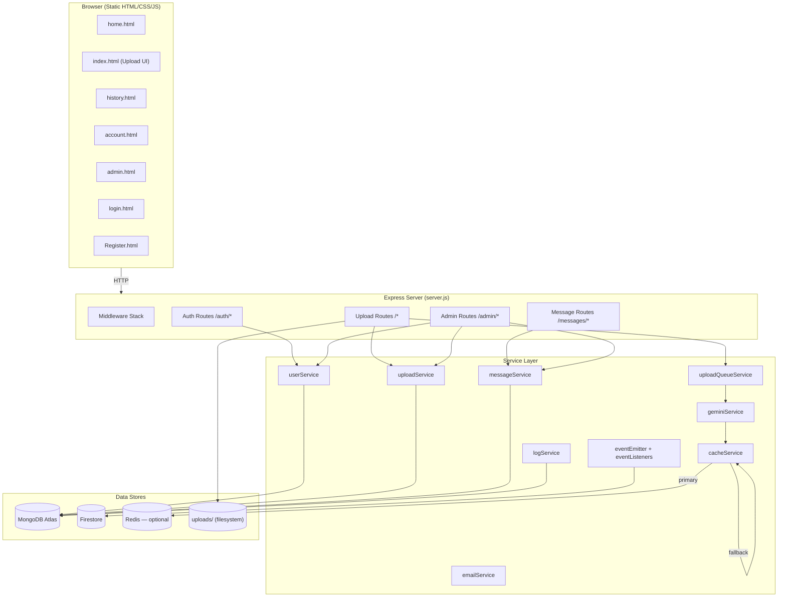
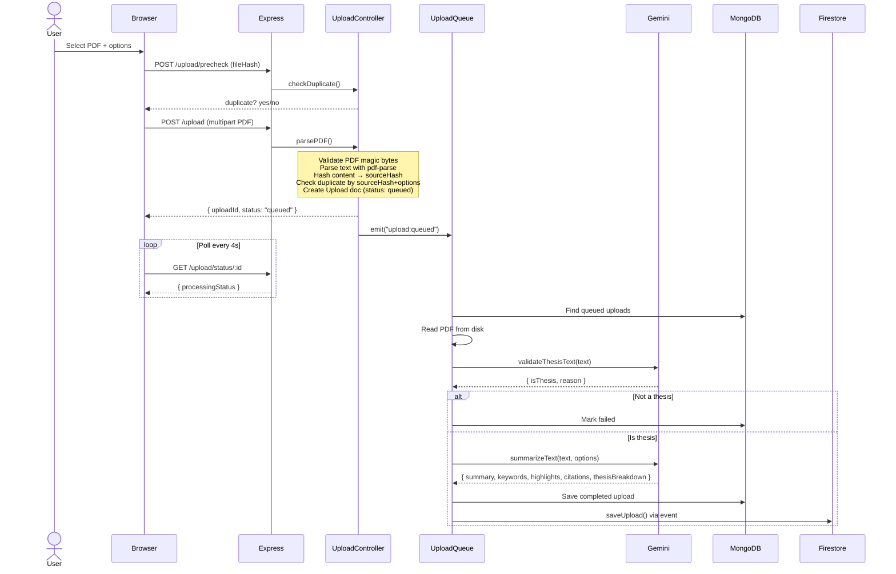

# CloudPDF — System Overview

CloudPDF is a **Node.js / Express** web application for thesis PDF summarisation. Users upload academic PDFs, the system validates them as thesis-like documents, then uses **Google Gemini** to produce structured summaries, keywords, highlights, citations, and full thesis breakdowns. An admin dashboard provides user/upload/message moderation and analytics.

**Live deployment:** https://cloudpdf-o2q9.onrender.com/

---

## High-Level Architecture

---

## Project Structure

| Path | Purpose |
|---|---|
| [server.js](file:///c:/Users/Cadig/Downloads/CloudPDF/server.js) | Entry point — wires DB, middleware, routes, error handler |
| [config/](file:///c:/Users/Cadig/Downloads/CloudPDF/config) | DB connection, Firestore init, app-wide constants |
| [models/](file:///c:/Users/Cadig/Downloads/CloudPDF/models) | Mongoose schemas: `User`, `Upload`, `Message`, `Log` |
| [controllers/](file:///c:/Users/Cadig/Downloads/CloudPDF/controllers) | Request handlers for auth, uploads, admin, messages |
| [routes/](file:///c:/Users/Cadig/Downloads/CloudPDF/routes) | Express router definitions with rate limiters |
| [services/](file:///c:/Users/Cadig/Downloads/CloudPDF/services) | Business logic, AI calls, caching, email, logging, events |
| [middleware/](file:///c:/Users/Cadig/Downloads/CloudPDF/middleware) | CSRF, auth guard, admin guard, rate limiter, error handler |
| [public/](file:///c:/Users/Cadig/Downloads/CloudPDF/public) | Static frontend (HTML pages, CSS, JS) |
| [uploads/](file:///c:/Users/Cadig/Downloads/CloudPDF/uploads) | Temporary storage for uploaded PDF files |

---

## Data Models

### [User](file:///c:/Users/Cadig/Downloads/CloudPDF/models/User.js)
| Field | Type | Notes |
|---|---|---|
| `username` | String | Unique |
| `email` | String | Unique, lowercase, trimmed |
| `password` | String | bcrypt-hashed |
| `isAdmin` | Boolean | Default `false` |
| `emailVerified` | Boolean | Default `false` |
| `otpCode / otpExpiresAt / otpAttempts / otpLastSentAt` | Mixed | OTP verification flow |
| `archived / archivedAt` | Boolean / Date | Soft delete |

### [Upload](file:///c:/Users/Cadig/Downloads/CloudPDF/models/Upload.js)
| Field | Type | Notes |
|---|---|---|
| `user` | ObjectId → User | Owner |
| `filename / originalname` | String | Disk filename + original name |
| `summary` | String | AI-generated summary |
| `sourceHash / fileHash / optionSignature` | String | Duplicate detection (indexed) |
| `summaryOptions` | Object | length, style, format, focusArea, toggles |
| `keywords / highlights / citations` | [String] | Optional AI-extracted arrays |
| `thesisBreakdown` | Mixed | Structured profile (title, authors, methodology, etc.) |
| `processingStatus` | Enum | `queued → processing → completed / failed / duplicate` |
| `processingError / duplicateOf` | String / ObjectId | Error info or duplicate ref |
| `archived / archivedAt` | Boolean / Date | Soft delete |

### [Message](file:///c:/Users/Cadig/Downloads/CloudPDF/models/Message.js)
| Field | Type | Notes |
|---|---|---|
| `user` | ObjectId → User | Sender/recipient |
| `username` | String | Denormalized |
| `senderRole` | Enum `user / admin` | Direction indicator |
| `subject / message` | String | Content |
| `replyTo` | ObjectId → Message | Thread parent |
| `readAt` | Date | Inbox read tracking |
| `archived / archivedAt` | Boolean / Date | Soft delete |

### [Log](file:///c:/Users/Cadig/Downloads/CloudPDF/models/Log.js)
| Field | Type | Notes |
|---|---|---|
| `level / action / method / path` | String | Structured log metadata |
| `statusCode / durationMs` | Number | Request metrics |
| `user / username` | ObjectId / String | Actor |
| `meta` | Mixed | Arbitrary context |

---

## Request Flow

### Upload Pipeline (core feature)

### Auth Flow
1. **Register** → validate email format → hash password → create User → generate OTP → send via Brevo email API → await verification
2. **Verify OTP** → check attempts limit → check expiry → mark `emailVerified`
3. **Login** → find by email → bcrypt compare → store session (`express-session` + MongoStore)
4. **Forgot/Reset Password** → send OTP → verify OTP → bcrypt hash new password
5. **Self-Destruct** → soft-delete user + uploads + messages

---

## Service Layer Details

### [geminiService](file:///c:/Users/Cadig/Downloads/CloudPDF/services/geminiService.js)
- Model: **`gemini-2.5-flash-lite`**
- Functions: `validateThesisText`, `summarizeText`, `compareTheses`, `findResearchGaps`, `prepareDefense`
- All AI calls go through `generateJson()` which caches results via `cacheService`
- Results are SHA-256 hashed for cache keys

### [uploadQueueService](file:///c:/Users/Cadig/Downloads/CloudPDF/services/uploadQueueService.js)
- Background processor started at boot via `setInterval` (configurable `POLL_INTERVAL_MS`, default 4s)
- Concurrency controlled by `MAX_CONCURRENT_UPLOADS` (default 1)
- Pipeline per upload: read file → validate PDF magic bytes → parse text → hash → check duplicate → validate thesis → summarize → save
- Emits `upload:completed` event on success

### [cacheService](file:///c:/Users/Cadig/Downloads/CloudPDF/services/cacheService.js)
- **Dual-layer**: Redis (primary, if `REDIS_URL` set) with in-memory `Map` fallback
- Auto-fallback on Redis failure (retries 2× then gives up)
- Supports: `get`, `set`, `delete`, `deleteCacheByPrefix`, `getOrSetCache`
- In-memory cache capped at `MAX_CACHE_ENTRIES` (default 1000)

### [emailService](file:///c:/Users/Cadig/Downloads/CloudPDF/services/emailService.js)
- Provider: **Brevo** (formerly Sendinblue) via REST API
- Used for OTP delivery (registration + password reset)

### [eventEmitter + eventListeners](file:///c:/Users/Cadig/Downloads/CloudPDF/services/eventListeners.js)
- Node.js `EventEmitter` singleton
- Events:
  - `user:registered` → replicate user to Firestore
  - `upload:completed` → replicate upload to Firestore
  - `upload:queued` → kick the upload queue processor

### [logService](file:///c:/Users/Cadig/Downloads/CloudPDF/services/logService.js)
- Winston logger to stdout + async persist to MongoDB `Logs` collection
- Whitelisted actions only (admin operations, user registration, account deletion)

---

## Middleware Stack

| Middleware | File | Purpose |
|---|---|---|
| Body parsers | built-in | `express.json()` + `express.urlencoded()` |
| Security headers | [server.js](file:///c:/Users/Cadig/Downloads/CloudPDF/server.js#L41-L50) | CSP, X-Frame-Options, nosniff, Referrer-Policy |
| Session | [server.js](file:///c:/Users/Cadig/Downloads/CloudPDF/server.js#L56-L73) | `express-session` + MongoStore, 1-hour cookie TTL |
| CSRF | [csrfMiddleware.js](file:///c:/Users/Cadig/Downloads/CloudPDF/middleware/csrfMiddleware.js) | Token-based, timing-safe comparison, skips GET/HEAD/OPTIONS |
| Rate Limiting | [rateLimit.js](file:///c:/Users/Cadig/Downloads/CloudPDF/middleware/rateLimit.js) | In-memory sliding window per route group (auth: 20/15min, upload: 12/15min, messages: 8/10min) |
| Auth Guard | [requireAuth.js](file:///c:/Users/Cadig/Downloads/CloudPDF/middleware/requireAuth.js) | Checks `req.session.user` exists |
| Admin Guard | [adminMiddleware.js](file:///c:/Users/Cadig/Downloads/CloudPDF/middleware/adminMiddleware.js) | Checks session user `isAdmin` flag |
| Error Handler | [errorMiddleware.js](file:///c:/Users/Cadig/Downloads/CloudPDF/middleware/errorMiddleware.js) | `AppError` class + `asyncHandler` + global catch-all |

---

## API Routes Summary

### Auth (`/auth`)
| Method | Path | Description |
|---|---|---|
| POST | `/register` | Register new user |
| POST | `/verify-otp` | Verify email OTP |
| POST | `/resend-otp` | Resend registration OTP |
| POST | `/forgot-password` | Request password reset |
| POST | `/reset-password` | Reset password with OTP |
| POST | `/login` | Login |
| GET | `/session` | Get current session |
| GET | `/dashboard-stats` | User dashboard stats |
| GET | `/logout` | Logout |
| POST | `/change-password` | Change password (authenticated) |
| POST | `/terminate` | Self-destruct account |

### Uploads (`/`)
| Method | Path | Description |
|---|---|---|
| POST | `/upload/precheck` | Client-side duplicate check |
| POST | `/upload` | Upload PDF (auth required) |
| GET | `/upload/status/:id` | Poll processing status |
| POST | `/analysis/compare` | Compare multiple theses (AI) |
| POST | `/analysis/gaps` | Find research gaps (AI) |
| POST | `/analysis/defense` | Generate defense brief (AI) |
| GET | `/uploads` | List user's completed summaries |
| GET | `/uploads/archived` | List archived uploads |
| POST | `/upload/:id/restore` | Restore archived upload |
| DELETE | `/upload/:filename` | Soft-delete upload |
| DELETE | `/upload/:id/permanent` | Permanently delete archived upload |

### Messages (`/messages`)
| Method | Path | Description |
|---|---|---|
| POST | `/` | Send message to admin |
| GET | `/inbox` | User's admin replies |
| GET | `/inbox/summary` | Unread count |
| POST | `/inbox/:id/read` | Mark inbox message read |

### Admin (`/admin`)
| Method | Path | Description |
|---|---|---|
| GET | `/users` | List users (paginated, searchable) |
| DELETE | `/users/:id` | Archive user |
| POST | `/users/:id/restore` | Restore archived user |
| DELETE | `/users/:id/permanent` | Permanently delete |
| PATCH | `/users/:id/admin` | Toggle admin role |
| GET | `/uploads` | List all uploads |
| DELETE | `/uploads/:id` | Archive upload |
| POST | `/uploads/:id/restore` | Restore upload |
| DELETE | `/uploads/:id/permanent` | Permanently delete |
| GET | `/messages` | List user messages |
| DELETE | `/messages/:id` | Archive message |
| POST | `/messages/:id/restore` | Restore message |
| DELETE | `/messages/:id/permanent` | Permanently delete |
| POST | `/messages/:id/reply` | Reply to user message |
| GET | `/logs` | Admin activity logs |
| GET | `/analytics` | Dashboard analytics |
| GET | `/archived` | Archived items overview |

---

## Frontend Pages

| File | Purpose |
|---|---|
| [home.html](file:///c:/Users/Cadig/Downloads/CloudPDF/public/home.html) | Landing page |
| [index.html](file:///c:/Users/Cadig/Downloads/CloudPDF/public/index.html) | Main upload & summary UI |
| [history.html](file:///c:/Users/Cadig/Downloads/CloudPDF/public/history.html) | Summary history viewer |
| [account.html](file:///c:/Users/Cadig/Downloads/CloudPDF/public/account.html) | Account settings & profile |
| [admin.html](file:///c:/Users/Cadig/Downloads/CloudPDF/public/admin.html) | Admin dashboard |
| [login.html](file:///c:/Users/Cadig/Downloads/CloudPDF/public/login.html) | Login page |
| [Register.html](file:///c:/Users/Cadig/Downloads/CloudPDF/public/Register.html) | Registration page |
| [script.js](file:///c:/Users/Cadig/Downloads/CloudPDF/public/script.js) | Main frontend logic (75 KB) |
| [adminscript.js](file:///c:/Users/Cadig/Downloads/CloudPDF/public/adminscript.js) | Admin dashboard logic (31 KB) |
| `style.css` — `style4.css` | Page-specific stylesheets |

---

## External Dependencies

| Package | Version | Purpose |
|---|---|---|
| `express` | ^5.2.1 | Web framework |
| `mongoose` | ^9.3.1 | MongoDB ODM |
| `express-session` + `connect-mongo` | ^1.19 / ^6.0 | Session management with Mongo store |
| `@google/generative-ai` | ^0.24.1 | Google Gemini SDK |
| `pdf-parse` | ^1.1.1 | PDF text extraction |
| `bcrypt` | ^6.0.0 | Password hashing |
| `multer` | ^2.1.0 | File upload handling (5 MB limit, PDF only) |
| `firebase-admin` | ^13.7.0 | Firestore replication |
| `ioredis` | ^5.11.1 | Redis cache client |
| `winston` | ^3.19.0 | Structured logging |
| `dotenv` | ^17.3.1 | Environment variable loading |

---

## Security Measures

- **Password hashing**: bcrypt with 10 salt rounds
- **CSRF protection**: Crypto-random token per session, timing-safe comparison on all mutating requests
- **Security headers**: CSP (strict), X-Frame-Options DENY, X-Content-Type-Options nosniff, Referrer-Policy same-origin
- **Rate limiting**: Per-route in-memory sliding window limiters
- **OTP protection**: Max 5 verification attempts, 10-minute expiry, cooldown on resend
- **Input sanitization**: Regex escaping for search queries, ObjectId validation via `toObjectId()`
- **Soft deletes**: Archived records are excluded from queries; permanent delete requires archived status first
- **Session security**: httpOnly cookies, sameSite lax, secure in production, 1-hour TTL
- **File validation**: PDF MIME type check (multer) + magic bytes check (`%PDF-`) in queue processor

---

## Environment Variables

| Variable | Required | Description |
|---|---|---|
| `MONGODB_URI` | ✅ | MongoDB Atlas connection string |
| `SESSION_SECRET` | ✅ (prod) | Session signing secret |
| `GEMINI_API` | ✅ | Google Gemini API key |
| `EMAIL_NAME` | ✅ | Sender email address for Brevo |
| `BREVO_API_KEY` | ✅ | Brevo transactional email API key |
| `REDIS_URL` | ❌ | Redis connection URL (falls back to in-memory) |
| `PORT` | ❌ | Server port (default 3000) |
| `NODE_ENV` | ❌ | `production` enables secure cookies + hides stack traces |
